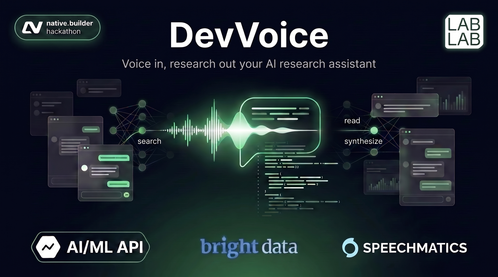
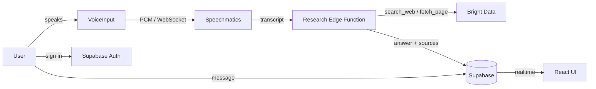

> A voice-powered developer research assistant built for the [native.builder](https://lablab.ai/ai-hackathons/nativebuilder-build-without-limits) hackathon. Speak a question, hear it transcribed, and get a researched answer with clickable source citations - all in a dark, AMOLED-first interface.

## Table of Contents

- [Table of Contents](#table-of-contents)
- [Highlights](#highlights)
- [Features](#features)
- [Architecture](#architecture)
- [Tech Stack](#tech-stack)
- [Getting Started](#getting-started)
  - [Deploying the Edge Function](#deploying-the-edge-function)
- [Validation](#validation)
- [SDD (Spec-Driven Development)](#sdd-spec-driven-development)
- [Acknowledgments](#acknowledgments)
- [License](#license)

## Highlights

- **Voice in, research out**: dictate a question and get a synthesized answer with sources.
- **Real-time speech-to-text** via Speechmatics, streamed as raw PCM over WebSocket.
- **Agentic research** with an Edge Function that searches and reads the web, returning cited answers.
- **Secure by default**: CSP enforced, secrets never reach the browser, Supabase Row-Level Security isolates user data.

## Features

- **Voice input**: tap-to-record microphone with real-time partial transcripts, editable before submit, and re-record.
- **Speechmatics STT**: official real-time client; the session JWT is passed via `client.start()` and never embedded in a URL.
- **Research pipeline**: a Supabase Edge Function (`supabase/functions/research/index.ts`) runs a search→read→synthesize loop and returns an answer plus clickable source citations; the AI/ML model is selectable per session. All inferences are served serverless via AI/ML API.
- **Web search integration**: Bright Data SERP API (Google searches) + Web Unlocker (page fetching) power the research agent.
- **Markdown answers**: assistant responses render as formatted markdown (headings, lists, code, tables, links) with source citations, XSS-safe by default.
- **Persistent conversations**: auth-gated chat history with sequential ordering and real-time updates.
- **Editable conversation titles**: click-to-edit inline, saved to Supabase (Enter/blur save, Escape cancel).
- **Copy response**: flat, borderless copy button beside assistant bubbles with `execCommand` fallback.
- **Auth**: email/password via Supabase, enforced password policy, and server-side rate limiting on auth endpoints (Supabase-managed).
- **Content Security Policy**: self-only sources with SRI hashing on the production build, Tailwind support in dev.

## Architecture



The Edge Function source lives in `supabase/functions/research/index.ts` and is deployed via `supabase functions deploy research`.

## Tech Stack

| Layer | Technology |
| ----- | ---------- |
| UI | React 19, TypeScript 7 (via @typescript/native), Vite 8, Tailwind CSS 3 |
| Testing | Vitest 4 |
| Auth & data | Supabase (Auth, Postgres, Realtime, Edge Functions) |
| Speech-to-text | @speechmatics/real-time-client |
| Research | Bright Data (SERP + Web Unlocker), AI/ML API |
| Security | CSP via vite-plugin-csp-guard, eslint-plugin-security |

## Getting Started

```bash
bun install
bun dev
```

Requirements: a Supabase project with the `research` Edge Function deployed and its secrets (`AIML_API_KEY`, `BRIGHTDATA_API_KEY`), plus a valid Bright Data and AI/ML API key. Database types are generated from the Supabase schema in `src/lib/database.types.ts`.

### Deploying the Edge Function

```bash
supabase functions deploy research
```

The function source is versioned at `supabase/functions/research/index.ts`.

## Validation

- **Typecheck**: `bun run typecheck` - 0 errors
- **Tests**: `bun run test` - 122 tests passing
- **Coverage**: `bun run test -- --coverage` - ~60%+ statements, ~79% branches (thresholds: 25/65/60/25)
- **Lint**: `bun run lint` - 0 errors
- **Build**: `bun run build` - OK

## SDD (Spec-Driven Development)

Security posture and system behavior are specified and verified through the SDD in `openspec/`:

- `security-posture`, `authentication`, `voice-input`, `research-pipeline`, `conversation-management`, `supabase-foundation`, `account-management`, `test-framework`
- Implementation is validated with `bun typecheck`, `bun lint` (eslint-plugin-security), and `bun audit`.
- Change tracking: `chat-composer-stt-copy-polish` (14 task groups, 40+ tasks completed).

## Acknowledgments

- [native.builder](https://lablab.ai/ai-hackathons/nativebuilder-build-without-limits) - hackathon organizer
- [lablab.ai](https://lablab.ai) - hackathon platform
- [Supabase](https://supabase.com) - auth, database, edge functions, realtime
- [Bright Data](https://brightdata.com) - web data collection (SERP + Web Unlocker)
- [AI/ML API](https://aimlapi.com) - serverless LLM inferences
- [Speechmatics](https://speechmatics.com) - real-time speech-to-text
- [Google DeepMind](https://deepmind.google) - Nano Banana Pro (banner generation)

## License

Provided as-is for the native.builder hackathon.
