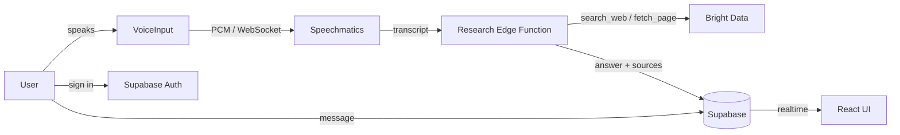

# DevVoice

A voice-powered developer research assistant built for the native.builder hackathon. Speak a question, hear it transcribed, and get a researched answer with clickable source citations: all in a dark, AMOLED-first interface.

## Highlights

- **Voice in, research out**: dictate a question and get a synthesized answer with sources.
- **Real-time speech-to-text** via Speechmatics, streamed as raw PCM over WebSocket.
- **Agentic research** with an Edge Function that searches and reads the web, returning cited answers.
- **Secure by default**: CSP enforced, secrets never reach the browser, Supabase Row-Level Security isolates user data.

## Features

- **Voice input**: tap-to-record microphone with real-time partial transcripts, editable before submit, and re-record.
- **Speechmatics STT**: official real-time client; the session JWT is passed via `client.start()` and never embedded in a URL.
- **Research pipeline**: a Supabase Edge Function runs a search→read→synthesize loop and returns an answer plus clickable source citations.
- **Persistent conversations**: auth-gated chat history with sequential ordering and real-time updates.
- **Auth**: email/password via Supabase, enforced password policy, and rate-limited sign-in attempts.
- **Content Security Policy**: self-only sources with SRI hashing on the production build, Tailwind support in dev.

## Architecture



## Tech Stack

| Layer | Technology |
| ----- | ---------- |
| UI | React, TypeScript, Vite, Tailwind CSS |
| Auth & data | Supabase (Auth, Postgres, Realtime, Edge Functions) |
| Speech-to-text | @speechmatics/real-time-client |
| Research | Bright Data (SERP + Web Unlocker), AI/ML API |
| Security | CSP via vite-plugin-csp-guard, eslint-plugin-security |

## Getting Started

```bash
bun install
bun dev
```

Requirements: a Supabase project with the `speechmatics-token` and `research` Edge Functions and their secrets, plus a valid Bright Data and AI/ML API key. Database types are generated from the Supabase schema in `src/lib/database.types.ts`.

## Validation

Security posture and system behavior are specified and verified through the SDD in `openspec/` (spec-driven development):

- `security-posture`, `authentication`, `voice-input`, `research-pipeline`, `conversation-management`, `supabase-foundation`
- Implementation is validated with `bun typecheck`, `bun lint` (eslint-plugin-security), and `bun audit`.

## License

Provided as-is for the native.builder hackathon.
